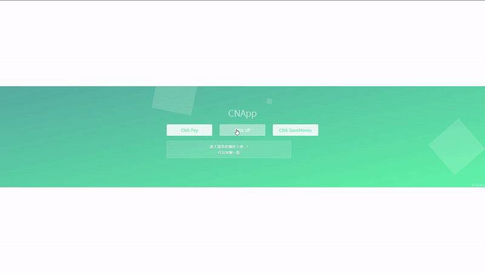
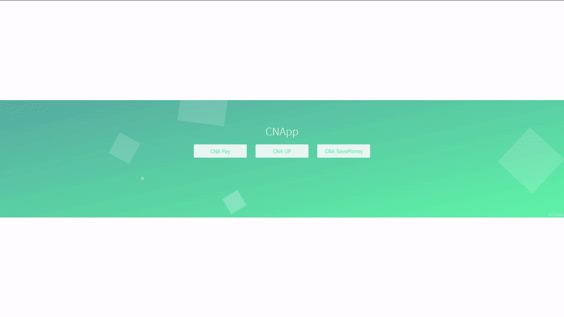

CNApp
===

For CCU CNA only, makes life easier.

## CNA Pay

填入月份、時數，自動報薪水。  
每日時數區間為 19:00 ~ 22:00，時數較多者會包含 08:00 ~ 12:00。  
日期不會包含例假日、國定假日、期末考週（沒事兒。  

## CNA UP

懶人無極限，  
輸入網管帳密和學號，
自動繳交工讀單。  

  

## CNA SaveMoney

+ 檢查未回覆之重要信件(值班、會議)
+ 提示最近一次薪水信
+ *查詢本月值班日期(待)*
+ *查詢機房檢測狀態(待)*

 